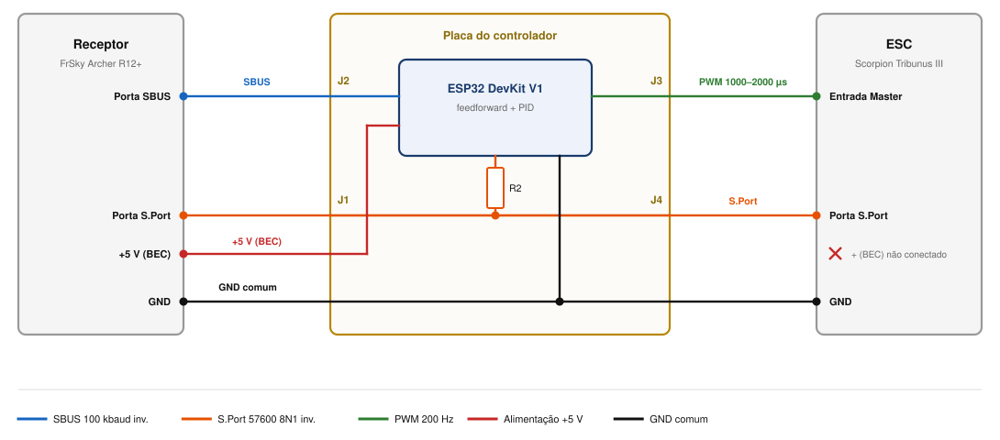
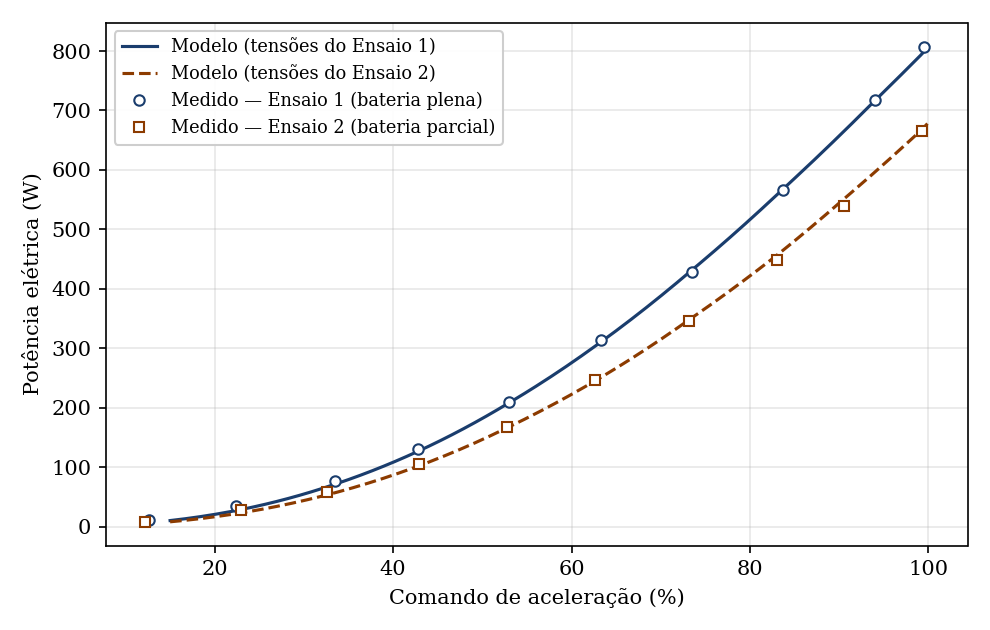
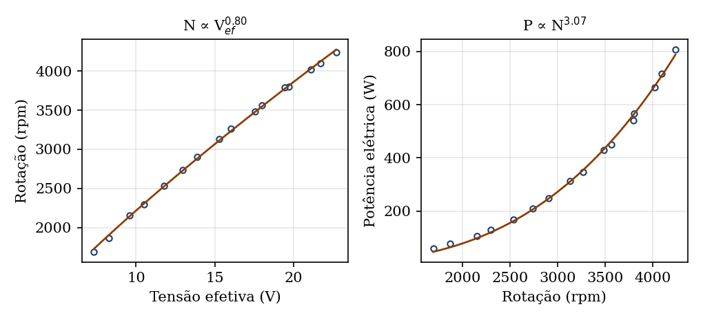
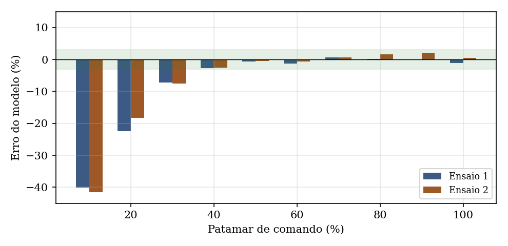
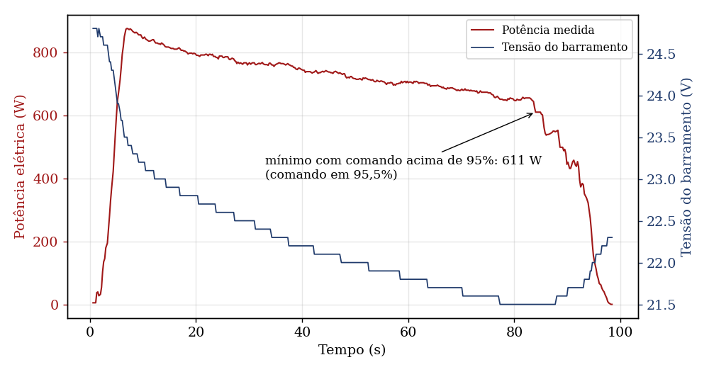
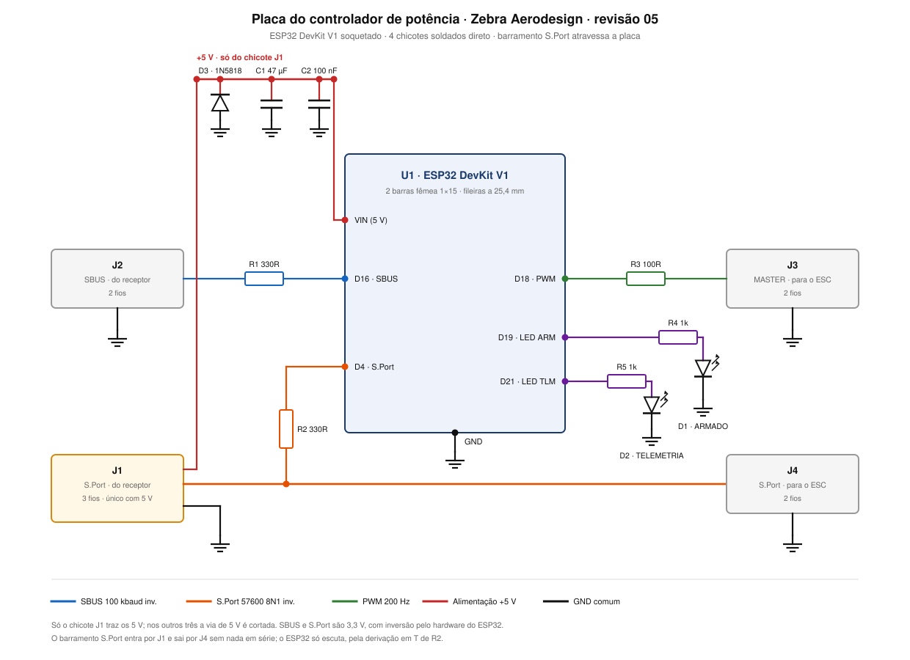

# Controle de potência para AeroDesign

**Controle PID com ação antecipatória da potência de propulsão de uma aeronave rádio-controlada de competição SAE BRASIL AeroDesign.**

Trabalho de graduação em Engenharia Elétrica (UNESP, Faculdade de Engenharia de Ilha Solteira), desenvolvido para a equipe **Zebra Aerodesign**.


---

## O problema

Num avião elétrico, o ESC entende o comando do piloto como uma fração da tensão da bateria. Conforme a bateria descarrega, a mesma posição do manche entrega cada vez menos potência. No ensaio de descarga deste trabalho, a potência caiu de **858 W para 641 W em 78 s**, com o comando praticamente fixo.

A saída usual é limitar o curso do manche no rádio. Isso atende ao limite de **600 W** da Classe Regular, mas não resolve a deriva: o piloto continua recebendo respostas diferentes para a mesma posição do manche ao longo do voo.

**O objetivo deste projeto é manter fixa a relação entre comando e potência durante todo o voo.** O atendimento ao limite regulamentar passa a ser uma consequência do controle, e não a finalidade dele.

## A solução

Um ESP32 fica entre o receptor e o ESC. Ele lê o comando do piloto, mede a potência pela telemetria do próprio ESC e calcula o comando que produz a potência desejada.



- **Comando do piloto:** lido pelo protocolo SBUS do receptor.
- **Comando para o ESC:** PWM de 1000 a 2000 µs, a 200 Hz.
- **Medição:** o ESP32 escuta o barramento S.Port entre o receptor e o ESC, sem transmitir nada. O piloto continua vendo a telemetria no rádio.
- **Alimentação:** 5 V do BEC, por um único chicote.

O motor e o ESC precisam ser comerciais, por regra da competição. Por isso o controle atua sobre o comando enviado ao ESC, e não sobre o acionamento do motor.

### Telemetria do ESC

A soma de verificação dos quadros do ESC Scorpion Tribunus III não segue a especificação pública do protocolo. O formato foi levantado por captura bruta e correlação com multímetro:

- quadro de 8 bytes com assinatura `10 50 0B` (sensor de potência do ESC, código `0x0B50`);
- tensão em 2 bytes, menos significativo primeiro, em centivolts;
- corrente em 2 bytes, menos significativo primeiro, em centiampères;
- taxa efetiva de dados novos de cerca de **5 Hz**.

O sincronismo é feito pela assinatura do cabeçalho, e não pela soma de verificação.

## Modelo do motor

O modelo foi levantado em bancada estática, com duas varreduras de comando em estados de carga diferentes (bateria plena e parcial). A estrutura vem da física do conjunto:

- a hélice consome potência proporcional ao cubo da rotação (expoente medido: **3,07**);
- a rotação cresce com a tensão efetiva aplicada pelo ESC (expoente medido: **0,80**).

Compondo os dois, o expoente previsto é 2,46. O ajuste direto deu 2,39, o que confirma a estrutura sem forçar o resultado.

$$P = 0{,}4620 \cdot \left(\frac{thr}{100} \cdot V\right)^{2{,}388}$$

em que `P` é a potência elétrica (W), `thr` é o comando (%) e `V` é a tensão da bateria (V).

| Estrutura | Parâmetros | R² | Erro médio quadrático no ajuste | Erro médio quadrático em dados novos |
|---|---|---|---|---|
| **Expoente único (adotada)** | 2 | 0,99957 | **4,8 W** | **18,8 W** |
| Dois expoentes | 3 | 0,99971 | 4,0 W | 16,3 W |
| Linear na tensão (usual) | 2 | 0,98719 | 26,4 W | 41,2 W |

Os "dados novos" são as 359 amostras do ensaio de descarga, que não entraram no ajuste. O modelo linear na tensão, que é a simplificação mais comum, erra cerca de cinco vezes mais, mesmo com R² aparentemente bom.





**Validade:** o erro fica dentro de **±3% para comando a partir de 40%**, que é a região onde o controle opera. Abaixo disso o erro relativo cresce, mas fica abaixo de 5 W em valor absoluto.



## Lei de controle

A ação antecipatória é o próprio modelo invertido. Ela já compensa a descarga sozinha, porque usa a tensão medida. A malha PID só corrige o que sobra.

$$thr_{ff} = \frac{100}{V} \cdot \left(\frac{P^{*}}{0{,}4620}\right)^{1/2{,}388}$$

$$thr_{out} = thr_{ff} + K_p \, e + K_i \int e \, dt - K_d \, \frac{dP_{med}}{dt}, \qquad e = P^{*} - P_{med}$$

| Ganho | Valor | Critério |
|---|---|---|
| `Kp` | 0,019 %/W | corrige 30% do erro por ação, com ganho da planta de 16,0 W/% |
| `Ki` | 0,097 %/(W·s) | erro residual de 1,8 W sob a descarga medida de 2,77 W/s |
| `Kd` | 0 | implementado para teste em bancada; derivada da medição, filtrada |

**Salvaguardas no firmware:**

- saída limitada de 0 a 100%, com anti-windup e teto no integrador;
- telemetria parada por mais de 500 ms: a malha é suspensa e o sistema segue só com a ação antecipatória;
- sem telemetria desde a energização: a ação antecipatória usa uma tensão alta, o que gera comando menor (o lado seguro do erro);
- arme só com o manche no mínimo por 2 s contínuos, com o link de rádio ativo;
- perda de link: desarma e zera o controlador;
- rádio Wi-Fi e Bluetooth do ESP32 desligados.

### Ensaio de descarga



O ensaio define o piso de tensão do envelope de voo (**21,50 V**) e o teto de potência que o sistema consegue sustentar até o fim da missão.

## Hardware

Placa perfurada de fenolite, dupla face, 40 x 60 mm, montada à mão, com o ESP32 DevKit V1 em soquete e quatro chicotes de sinal.



O documento completo da placa, com mapa de furos, lista de peças, ordem de montagem e roteiro de conferência com multímetro, está em [`hardware/hardware_zebra_rev05.html`](hardware/hardware_zebra_rev05.html). Baixe o arquivo e abra no navegador.

| Item | Modelo |
|---|---|
| Microcontrolador | ESP32 DevKit V1, 30 pinos |
| Rádio e receptor | FrSky Tandem X18 e Archer R12+ |
| ESC | Scorpion Tribunus III |
| Bateria | LiPo 6S |

## Firmware

| Pasta | Para que serve |
|---|---|
| [`firmware/zebra_fc_rev01`](firmware/zebra_fc_rev01) | Bancada, com ligação por fio solto |
| [`firmware/zebra_fc_pcb_rev00`](firmware/zebra_fc_pcb_rev00) | Placa: LEDs de estado, máquina de estados, registro em CSV a 10 Hz e conferência dos parâmetros ao ligar |

As duas versões usam o mesmo modelo, os mesmos ganhos e a mesma curva de referência.

**Como compilar (Arduino IDE):**

1. Instale o pacote de placas ESP32 da Espressif.
2. Copie `firmware/libs/Bolder_Flight_Systems_SBUS` para a pasta de bibliotecas do Arduino. É a biblioteca SBUS da Bolder Flight Systems (v8.1.4), com modificações minhas, sob a licença MIT original.
3. Instale a biblioteca **ESP32Servo** (v3.1.3) pelo gerenciador de bibliotecas.
4. Abra o `.ino` da versão desejada e selecione a placa "ESP32 Dev Module".

> **Atenção:** o firmware aciona o motor. Faça os testes com a hélice fora ou com a aeronave presa em bancada.

## Ensaios

| Arquivo | Conteúdo |
|---|---|
| `ensaios/brutos/10em10_full.csv` | Varredura de comando de 10 em 10%, bateria plena |
| `ensaios/brutos/10em10_midle.csv` | Varredura de comando, bateria parcial |
| `ensaios/brutos/10em10_baixo.csv` | Varredura de comando, bateria baixa (fora do envelope de voo, não usada no ajuste) |
| `ensaios/brutos/full_full.csv` | Descarga com comando próximo do pleno, partindo de bateria plena |
| `ensaios/Progressão_FULLBAT.xlsx` e `ensaios/Progressão_HALFBAT.xlsx` | Recortes das duas varreduras usadas no ajuste do modelo |
| `ensaios/SimulaçãoDecolagem_FULLBAT_CONDIÇÃO_REAL_VOO.xlsx` | Recorte do ensaio de descarga, usado na validação |

Os CSV são os originais, gravados pelo registrador interno do ESC, separados por ponto e vírgula e com vírgula decimal. As colunas incluem tempo, comando, corrente, tensão, potência elétrica e rotação do motor. As planilhas são recortes deles, sem nenhum valor alterado.

## Estado atual

- [x] Decodificação da telemetria do ESC
- [x] Caracterização do conjunto em bancada e modelo validado
- [x] Lei de controle projetada e firmware pronto para gravar
- [x] Placa projetada e conferida contra o esquema
- [ ] Montagem da placa
- [ ] Medição da perda entre o wattímetro da competição e o ESC, para fechar a potência máxima da curva (hoje provisória em 575 W)
- [ ] Sintonia em bancada, em quatro fases: ação antecipatória isolada, depois `Kp`, `Ki` e `Kd`
- [ ] Comparação entre malha aberta e malha fechada

Os resultados de bancada entram aqui assim que forem medidos.

## Estrutura

```
controle-potencia-aerodesign/
├── firmware/
│   ├── zebra_fc_rev01/          versão de bancada
│   ├── zebra_fc_pcb_rev00/      versão da placa
│   └── libs/                    biblioteca SBUS modificada
├── hardware/                    documento da placa, esquema e diagrama elétrico
├── ensaios/                     dados brutos do ESC e planilhas de análise
└── figuras/                     gráficos e diagramas desta página
```

## Autor

**Guilherme Silva Filardi**, Engenharia Elétrica, UNESP Ilha Solteira.

[LinkedIn](https://www.linkedin.com/in/guilhermefilardifeis) · [E-mail](mailto:guifilardi@gmail.com)
